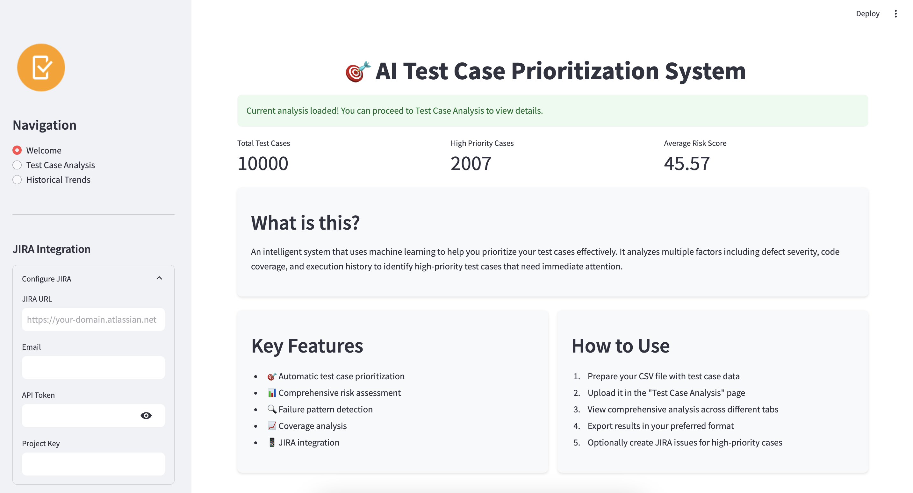
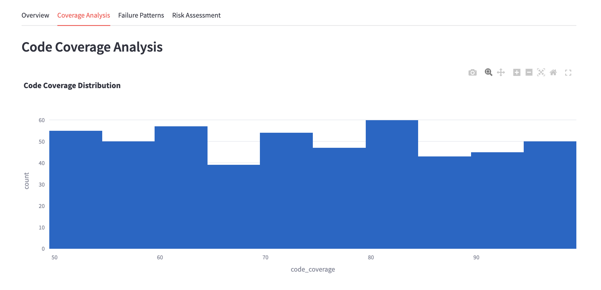
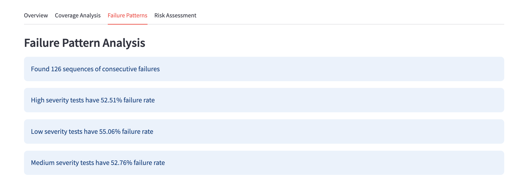
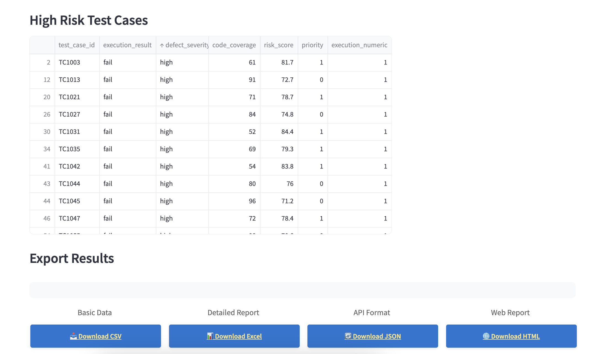
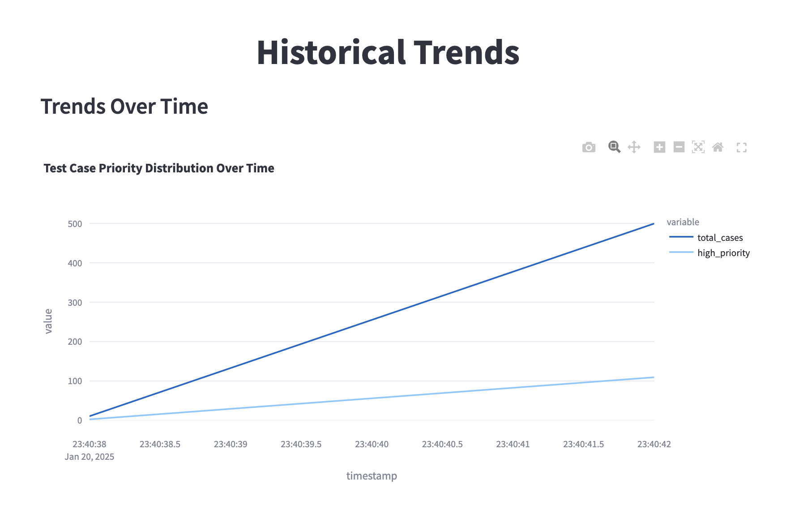

# AI Test Case Prioritization System

An intelligent system that uses machine learning to prioritize test cases based on multiple factors including defect severity, code coverage, and execution history.



## 🌟 Features

### Core Functionality
- **Test Case Prioritization**: Automatically assigns priority (0 or 1) to test cases
- **Risk Assessment**: Calculates risk scores based on multiple factors
- **Failure Pattern Detection**: Identifies sequences and patterns in test failures
- **Coverage Analysis**: Visualizes and analyzes code coverage metrics
- **Historical Trend Analysis**: Tracks test case performance over time

### Analytics and Visualization
- Interactive dashboards with Plotly charts
- Real-time data processing and analysis
- Comprehensive failure pattern detection
- Risk score distribution analysis
- Code coverage correlation analysis

### Integration Features
- JIRA issue tracking integration
- Multiple export formats (CSV, Excel, JSON)
- Historical data tracking
- Easy-to-use file upload interface

## Code Tree
```ai_test_case_prioritization/
├── README.md                # Project documentation
├── requirements.txt         # Dependencies
├── streamlit_app.py        # Main Streamlit application
├── train_new_model.py      # Model training script
├── model/                  # Trained model storage
│   └── test_case_priority_model.pkl
├── data/                   # Data directory
│   └── sample_test_cases.csv
├── generator/              # Test case generation utilities
│   ├── test_cases_generator.py
│   └── training_dataSet_generator.py
└── app_preview.png         # Application screenshot```
## 🚀 Getting Started

### Prerequisites
```bash
Python 3.8+
pip (Python package manager)
```

### Installation
1. Clone the repository:
```bash
git clone https://github.com/your-username/ai_test_case_prioritization.git
cd ai_test_case_prioritization
```

2. Install dependencies:
```bash
pip install -r requirements.txt
```

3. Train the model:
```bash
python train_new_model.py
```

4. Run the application:
```bash
streamlit run streamlit_app.py
```

## 📊 Usage Guide

### 1. Prepare Your Data
Create a CSV file with the following columns:
- `test_case_id`: Unique identifier for each test case
- `execution_result`: Test result (pass/fail)
- `defect_severity`: Severity level (low/medium/high)
- `code_coverage`: Coverage percentage (0-100)

Example:
```csv
test_case_id,execution_result,defect_severity,code_coverage
TC001,pass,low,85
TC002,fail,high,65
TC003,pass,medium,90
```

### 2. Using the Application
1. Access the application at `http://localhost:8501`
2. Upload your test cases CSV file
3. View analysis across different tabs:
   - Overview
   - Coverage Analysis
   - Failure Patterns
   - Risk Assessment
4. Export results in your preferred format
5. Optionally integrate with JIRA for issue tracking

### 3. Understanding the Results
- **Priority Scores**: 
  - 0: Normal priority
  - 1: High priority
- **Risk Score**: 0-100 scale based on:
  - Defect severity (40%)
  - Code coverage (30%)
  - Execution history (30%)

## 🔧 Configuration

### JIRA Integration
1. In the sidebar, enter your JIRA credentials:
   - JIRA URL
   - Email
   - API Token
   - Project Key
2. Click "Create JIRA Issues" for high-priority cases

### Export Options
- CSV: Complete dataset with predictions
- Excel: Detailed worksheets with analysis
- JSON: Structured data format
- HTML: Interactive report

## 📈 Features in Detail

### Risk Assessment
- Comprehensive risk scoring algorithm
- Multiple factor analysis
- Trend visualization
- High-risk test case identification

### Failure Pattern Detection
- Sequential failure analysis
- Pattern recognition
- Severity-based failure rates
- Historical trend analysis

### Coverage Analysis
- Distribution visualization
- Severity correlation
- Coverage impact analysis
- Trend tracking

### Historical Analysis
- Performance tracking over time
- Trend identification
- Pattern recognition
- Improvement metrics

### Integration with JIRA
- Issue creation for high-priority cases
- Integration with JIRA for issue tracking

### Export Options
- CSV: Complete dataset with predictions
- Excel: Detailed worksheets with analysis
- JSON: Structured data format
- HTML: Interactive report

## Screenshots



